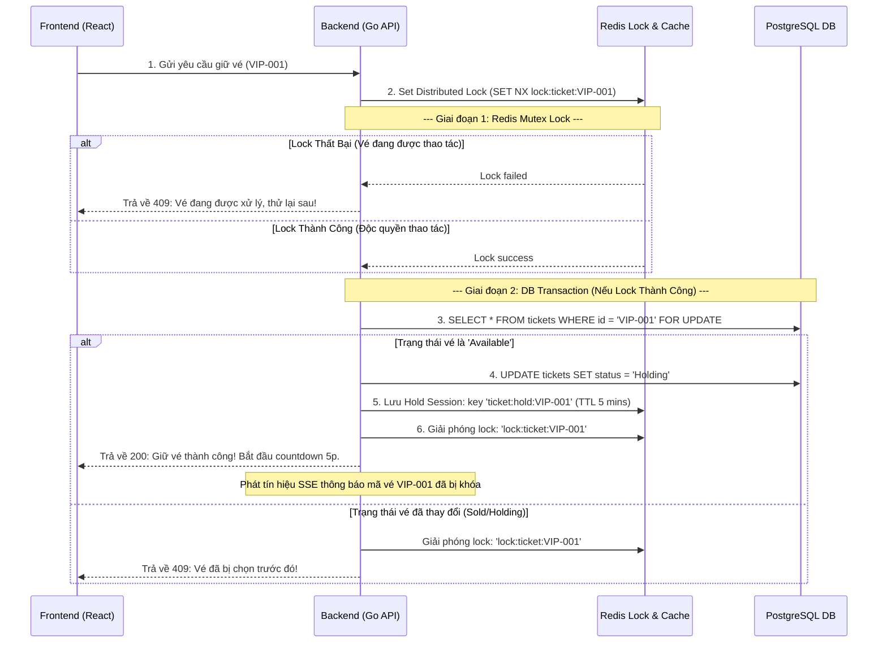

# TICKETBOX - HỆ THỐNG ĐẶT VÉ CONCERT TẢI CAO

Dự án này là bài thi kỹ thuật (Technical Test) xây dựng hệ thống bán vé concert Ticketbox với khả năng chịu tải cao, chống over-selling (bán quá số lượng) và cập nhật trạng thái thời gian thực (Real-time).

---

## 1. THÔNG TIN ỨNG VIÊN & TÀI KHOẢN THỬ NGHIỆM

- **Họ và tên**: Tất Tấn Lâm
- **Vị trí ứng tuyển**: Fullstack Developer (Golang + React)
- **Email**: tattanlam.work@gmail.com

### Tài khoản thử nghiệm (Đã có sẵn trong Database):
Hệ thống tự động Seed tài khoản mặc định khi khởi chạy dự án:

| Quyền hạn | Tên đăng nhập (Username) | Mật khẩu (Password) |
| :--- | :--- | :--- |
| **Khách hàng (User)** | `user` | `user123` |
| **Quản trị viên (Admin)** | `admin` | `admin123` |

---

## 2. CÁC TÍNH NĂNG CHÍNH & CƠ CHẾ GIẢ LẬP CHỊU TẢI (SIMULATOR)

### Các tính năng cốt lõi đã hoàn thiện:
* **Sơ đồ ghế ngồi động (Real-time Seat Map)**: 500 ghế chia làm 3 hạng vé (VIP, GA, Standard) được cập nhật trạng thái giữ/bán/hủy tức thời cho tất cả các client đang xem thông qua Server-Sent Events (SSE).
* **Đồng hồ đếm ngược giữ vé (5-Minute Hold Timer)**: Khóa giữ vé độc quyền trong 5 phút. Có background worker tự động quét và giải phóng vé quá hạn để trả lại sơ đồ nếu người dùng không thanh toán.
* **Quy trình thanh toán Idempotent (Chống trùng lặp)**: Áp dụng cơ chế Idempotency Control ngăn chặn trừ tiền hai lần hoặc tạo trùng hóa đơn khi bấm thanh toán nhiều lần.
* **Trang Admin & Quản trị**: Theo dõi doanh thu thực tế, số lượng vé bán, biểu đồ phân tích trạng thái vé, và nút Reset toàn bộ hệ thống về trạng thái ban đầu chỉ với 1 click.
* **Code Splitting & Tối ưu hóa dung lượng**: Giảm tải ban đầu, tách biệt hoàn toàn mã nguồn trang Admin để tăng tốc độ tải trang và bảo mật.

### Hướng dẫn kiểm thử tính năng chịu tải và tranh chấp ghế (Concurrency Load Test):
Dự án được tích hợp sẵn một **Hệ thống Giả lập tự động (Simulator)** ở trang Admin để người kiểm thử có thể trực tiếp quan sát cách hệ thống xử lý tranh chấp:

1. Đăng nhập tài khoản Quản trị viên (`admin` / `admin123`) và truy cập trang **Admin**.
2. Tìm và kích hoạt nút **"Kích hoạt Giả lập (Simulator)"** (giả lập 20-50 users mua vé liên tục).
3. Hệ thống sẽ tự động bật các tiến trình ảo lập trình sẵn:
   - Các luồng giả lập người dùng ảo liên tục gửi request đặt giữ các ghế ngẫu nhiên.
   - Mô phỏng người dùng mua vé thành công, hủy giữ vé, hoặc để vé tự động hết hạn 5 phút.
4. Mở song song một tab trình duyệt khác đăng nhập tài khoản Khách hàng (`user` / `user123`) tại trang **Đặt vé**:
   - Bạn sẽ nhìn thấy sơ đồ ghế liên tục thay đổi trạng thái nhấp nháy theo thời gian thực (Đang giữ vé màu vàng, Đã bán màu đỏ, Ghế trống màu xám/xanh/tím).
   - Hãy thử click tranh ghế với Simulator: Bạn sẽ thấy hệ thống trả về thông báo lỗi tranh chấp tức thì (`409 Conflict`) nếu ghế đó đã bị luồng giả lập của admin chiếm trước dù chỉ 1ms, chứng minh tính toàn vẹn dữ liệu hoàn hảo dưới tải cao.

---

## 3. KIẾN TRÚC HỆ THỐNG & GIẢI PHÁP KỸ THUẬT

Hệ thống được thiết kế theo mô hình **Clean Architecture** (Kiến trúc sạch) nhằm độc lập hóa các lớp nghiệp vụ, tách biệt phần cơ sở dữ liệu và Web framework:

- **Frontend**: ReactJS (Vite) + Tailwind CSS v4 + Lucide Icons.
- **Backend**: Golang (Clean Architecture) + Gin Gonic + GORM.
- **Cơ sở dữ liệu**: PostgreSQL (Đảm bảo tính nhất quán dữ liệu ACID).
- **Caching & Locking**: Redis.
- **Real-time Updates**: Server-Sent Events (SSE).

### Sơ đồ Luồng Xử Lý & Chống Race Condition (Over-selling):

Khi hàng ngàn request đồng thời gửi lên để giữ một mã vé cụ thể (ví dụ: `VIP-001`), hệ thống xử lý như sau:



### Các Giải pháp Kỹ thuật then chốt:

1. **Pessimistic Locking (`SELECT ... FOR UPDATE`)**: Khi luồng chạy qua lớp DB trong Postgres transaction, dòng dữ liệu của vé cụ thể sẽ bị khóa chặt. Không có bất kỳ giao dịch nào khác có thể ghi hoặc đọc-khóa trên dòng đó cho đến khi transaction hiện tại được Commit hoặc Rollback. Tránh hoàn toàn việc bán trùng vé.
2. **Redis Distributed Lock (SET NX)**: Đóng vai trò là chốt chặn đầu tiên (cửa ngõ) ở RAM trước khi request chạm vào DB, giúp bảo vệ DB khỏi nghẽn I/O khi có hàng ngàn click spam cùng lúc vào một vị trí vé.
3. **Idempotency API Control**: Sử dụng `Idempotency-Key` kết hợp lưu vết trạng thái `processing` và kết quả giao dịch `completed` trên Redis nhằm chống trùng lặp thanh toán khi người dùng click liên tục hoặc mạng chập chờn.
4. **Background Expiry Worker**: Một Goroutine ngầm chạy độc lập mỗi 3 giây quét DB để tự động reset các vé ở trạng thái `Holding` có `hold_expiry` nhỏ hơn thời gian hiện tại về trạng thái `Available` (nếu hết 5 phút mà user chưa thanh toán).
5. **SSE Delta Broadcast & Local Cache Mutation**: Thiết lập kết nối SSE (Server-Sent Events) hiệu năng cao truyền tải gói tin delta (chứa thông tin trạng thái ghế cụ thể thay đổi bao gồm `heldBy` và `expiry` time). Các client khi nhận sự kiện sẽ tự động chỉnh sửa trực tiếp dữ liệu trong bộ nhớ cục bộ (React Query Cache) mà không cần gọi lại API GET `/api/tickets`. Cơ chế này giúp **giảm cuộc gọi GET về 0 khi có giao dịch**, giảm tải cực hạn cho băng thông mạng và cơ sở dữ liệu.
6. **Kiến trúc Clean Code & Phân rã Component**:
   - **Backend Middlewares**: Tách biệt hoàn toàn các logic phụ trợ như CORS, Chống trùng lặp (Idempotency) và Xác thực (Auth/Admin) ra khỏi Handler và cấu trúc vào package `middleware` riêng biệt.
   - **Vite React Fast Refresh**: Phân rã tệp Context hỗn hợp thành tệp khai báo thuần TypeScript `TicketContext.ts` và tệp Component React `TicketProvider.tsx` giúp Vite HMR (Hot Module Replacement) có thể reload cực nhanh tại môi trường phát triển.
   - **Frontend Page Splitting**: Tách trang đặt vé lớn thành các component nhỏ hơn: `CheckoutForm.tsx` (nhập thông tin), `HoldSummary.tsx` (vé đang giữ), và `SelectionSummary.tsx` (vé đang chọn tạm thời) để tăng tính tái sử dụng và khả năng maintain.

---

## 4. CẤU TRÚC THƯ MỤC BACKEND & FRONTEND

```text
ticketbox/
├── backend/                  # Mã nguồn Backend (Golang - Clean Architecture)
│   ├── domain/               # Thực thể nghiệp vụ (Entities) & Interface quy chuẩn
│   │   └── ticket.go         # Struct Ticket & các interfaces Repository/UseCase
│   ├── repository/           # Triển khai lớp lưu trữ (Data Persistence Adapters)
│   │   └── ticket_repository.go # Tác vụ DB PostgreSQL (GORM) & Redis Caching
│   ├── usecase/              # Lớp quy tắc nghiệp vụ cốt lõi (Business Logic Layer)
│   │   ├── ticket_usecase.go # Điều phối và thực thi nghiệp vụ đặt vé
│   │   └── ticket_usecase_test.go # Unit tests kiểm tra concurrency & models
│   ├── delivery/             # Giao tiếp lớp ngoài (Presentation Layer)
│   │   ├── http/             # Cấu hình Gin REST API handlers
│   │   └── sse/              # Quản lý Server-Sent Events broker phục vụ real-time
│   ├── middleware/           # Các HTTP middlewares xử lý chung (CORS, Idempotency, Auth)
│   │   ├── cors.go           # Cấu hình headers CORS
│   │   ├── idempotency.go    # Chống trùng lặp giao dịch (Idempotency-Key)
│   │   └── auth.go           # Xác thực phiên người dùng & phân quyền Admin
│   ├── config/               # Khởi tạo kết nối hạ tầng (Postgres, Redis client)
│   ├── Dockerfile            # Dockerfile build backend stage
│   ├── main.go               # Entrypoint lắp ghép Dependency Injection & khởi chạy
│   └── ...
├── frontend/                 # Giao diện Frontend (ReactJS + Tailwind CSS v4)
│   ├── src/
│   │   ├── components/       # UI Components
│   │   │   ├── booking/      # Các component đặt vé (CheckoutForm, HoldSummary, SelectionSummary, Grid, ...)
│   │   │   └── common/       # Các component chung (Header, Footer)
│   │   ├── context/          # Các Context đồng bộ trạng thái (AuthContext, TicketContext, TicketProvider)
│   │   ├── hooks/            # Các custom hooks chứa business logic (useAuth, useTickets)
│   │   ├── pages/            # Các trang giao diện chính (Home, Booking, Admin)
│   │   └── ...
│   ├── Dockerfile            # Dockerfile build frontend stage với Nginx
│   └── ...
├── docker-compose.yml        # Cấu hình container hóa chạy toàn bộ hệ thống
└── README.md                 # Tài liệu hướng dẫn
```

---

## 5. HƯỚNG DẪN CÀI ĐẶT & CHẠY DỰ ÁN

Khuyến khích chạy dự án bằng **Docker Compose** để tự động cài đặt môi trường mà không cần cài đặt cục bộ Go, Node.js, Postgres hay Redis.

### Cách 1: Chạy bằng Docker Compose (Khuyên dùng)

1. Đảm bảo máy tính của bạn đã cài đặt **Docker** và **Docker Desktop** (hoặc Docker Compose).
2. Mở terminal tại thư mục gốc của dự án (`ticketbox`) và chạy lệnh:
   ```bash
   docker compose up --build
   ```
3. Sau khi Docker build và khởi động thành công các container:
   - **Frontend Web Application**: Truy cập tại [http://localhost:3000](http://localhost:3000)
   - **Backend API Gateway**: Chạy tại [http://localhost:8080](http://localhost:8080)
   - **Interactive Swagger UI (Tài liệu API)**: Xem tài liệu và gọi thử trực tiếp tại [http://localhost:8080/swagger/index.html](http://localhost:8080/swagger/index.html)
   - **PostgreSQL Database**: Port `5432`
   - **Redis Server**: Port `6379`

_Lưu ý: Backend có tích hợp cơ chế tự động kết nối lại (retries) đề phòng trường hợp PostgreSQL khởi động chậm hơn Go._

### Cách 2: Chạy thủ công từng phần ở Local

#### Bước 1: Khởi động Database & Redis

Bạn cần chạy Postgres (tạo sẵn Database tên `ticketbox`) và Redis cục bộ trên máy tính.

#### Bước 2: Chạy Backend (Go)

1. Di chuyển vào thư mục `backend`:
   ```bash
   cd backend
   ```
2. Cấu hình các thông số trong tệp [backend/.env](file:///d:/work/interviews/namviet/backend/.env) (nếu cần đổi tài khoản DB/Redis).
3. Biên dịch và khởi chạy server Go:
   - Hệ thống sẽ tự động tạo bảng (`AutoMigrate`) và tự động chèn 500 vé (`Seeding`) trong lần chạy đầu tiên.
   ```bash
   go run main.go
   ```

#### Bước 3: Chạy Frontend (React)

1. Mở một terminal mới và di chuyển vào thư mục `frontend`:
   ```bash
   cd frontend
   ```
2. Cài đặt các package và chạy môi trường phát triển:
   ```bash
   npm install
   npm run dev
   ```
3. Truy cập tại: [http://localhost:5173/](http://localhost:5173/)
