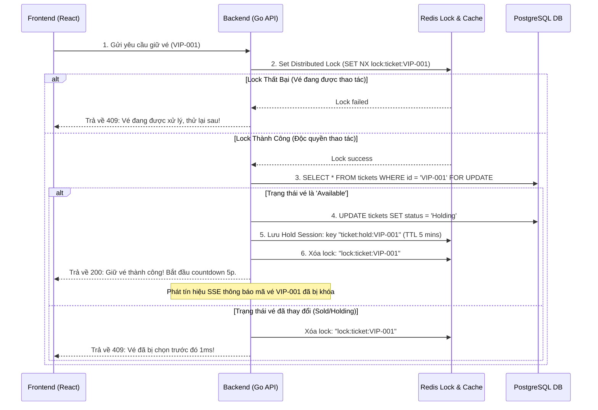

# TICKETBOX - HỆ THỐNG ĐẶT VÉ CONCERT TẢI CAO

Dự án này là bài thi kỹ thuật (Technical Test) xây dựng hệ thống bán vé concert Ticketbox với khả năng chịu tải cao, chống over-selling (bán quá số lượng) và cập nhật trạng thái thời gian thực (Real-time).

---

## 1. THÔNG TIN ỨNG VIÊN

- **Họ và tên**: Tất Tấn Lâm
- **Vị trí ứng tuyển**: Fullstack Developer (Golang + React)
- **Email**: tattanlam.work@gmail.com
- **Số điện thoại**: 0902795906

---

## 2. KIẾN TRÚC HỆ THỐNG & GIẢI PHÁP KỸ THUẬT

Hệ thống được thiết kế theo mô hình **Clean Architecture** (Kiến trúc sạch) nhằm độc lập hóa các lớp nghiệp vụ, tách biệt phần cơ sở dữ liệu và Web framework:

- **Frontend**: ReactJS (Vite) + Tailwind CSS v4 + Lucide Icons.
- **Backend**: Golang (Clean Architecture) + Gin Gonic + GORM.
- **Cơ sở dữ liệu**: PostgreSQL (Đảm bảo tính nhất quán dữ liệu ACID).
- **Caching & Locking**: Redis.
- **Real-time Updates**: Server-Sent Events (SSE).

### Sơ đồ Luồng Xử Lý & Chống Race Condition (Over-selling):

Khi hàng ngàn request đồng thời gửi lên để giữ một mã vé cụ thể (ví dụ: `VIP-001`), hệ thống xử lý như sau:



### Các Giải pháp Kỹ thuật then chốt:

1. **Pessimistic Locking (`SELECT ... FOR UPDATE`)**: Khi luồng chạy qua lớp DB trong Postgres transaction, dòng dữ liệu của vé cụ thể sẽ bị khóa chặt. Không có bất kỳ giao dịch nào khác có thể ghi hoặc đọc-khóa trên dòng đó cho đến khi transaction hiện tại được Commit hoặc Rollback. Tránh hoàn toàn việc bán trùng vé.
2. **Redis Distributed Lock (SET NX)**: Đóng vai trò là chốt chặn đầu tiên (cửa ngõ) ở RAM trước khi request chạm vào DB, giúp bảo vệ DB khỏi nghẽn I/O khi có hàng ngàn click spam cùng lúc vào một vị trí vé.
3. **Background Expiry Worker**: Một Goroutine ngầm chạy độc lập mỗi 3 giây quét DB để tự động reset các vé ở trạng thái `Holding` có `hold_expiry` nhỏ hơn thời gian hiện tại về trạng thái `Available` (nếu hết 5 phút mà user chưa thanh toán).
4. **SSE Real-time Broadcast**: Sử dụng cơ chế SSE (Server-Sent Events) hiệu năng cao, thiết lập một kết nối HTTP duy nhất (Keep-Alive) để đẩy sự kiện thay đổi trạng thái của vé (`held`, `released`, `sold`, `reset`) tới toàn bộ các client đang kết nối mà không cần client phải reload (F5) trang.

---

## 3. CẤU TRÚC THƯ MỤC BACKEND (CLEAN ARCHITECTURE)

```text
ticketbox/
├── backend/                  # Mã nguồn Backend (Golang - Clean Architecture)
│   ├── domain/               # Thực thể nghiệp vụ (Entities) & Interface quy chuẩn
│   │   └── ticket.go         # Struct Ticket & các interfaces Repository/UseCase
│   ├── repository/           # Triển khai lớp lưu trữ (Data Persistence Adapters)
│   │   └── ticket_repository.go # Tác vụ DB PostgreSQL (GORM) & Redis Caching
│   ├── usecase/              # Lớp quy tắc nghiệp vụ cốt lõi (Business Logic Layer)
│   │   ├── ticket_usecase.go # Điều phối và thực thi nghiệp vụ đặt vé
│   │   └── ticket_usecase_test.go # Unit tests kiểm tra concurrency & models
│   ├── delivery/             # Giao tiếp lớp ngoài (Presentation Layer)
│   │   ├── http/             # Cấu hình Gin REST API handlers
│   │   └── sse/              # Quản lý Server-Sent Events broker phục vụ real-time
│   ├── config/               # Khởi tạo kết nối hạ tầng (Postgres, Redis client)
│   ├── Dockerfile            # Dockerfile build backend stage
│   ├── main.go               # Entrypoint lắp ghép Dependency Injection & khởi chạy
│   └── ...
├── frontend/                 # Giao diện Frontend (ReactJS + Tailwind CSS v4)
│   ├── src/
│   │   ├── components/       # Các UI Component tách biệt (Header, Footer, Grid, Receipt...)
│   │   ├── context/          # Đồng bộ dữ liệu state & SSE (tích hợp API + Fallback Mock Mode)
│   │   ├── pages/            # Các trang giao diện chính (Home, Booking, Admin)
│   │   └── ...
│   ├── Dockerfile            # Dockerfile build frontend stage với Nginx
│   └── ...
├── docker-compose.yml        # Cấu hình container hóa chạy toàn bộ hệ thống
└── README.md                 # Tài liệu hướng dẫn
```

---

## 4. HƯỚNG DẪN CÀI ĐẶT & CHẠY DỰ ÁN

Khuyến khích chạy dự án bằng **Docker Compose** để tự động cài đặt môi trường mà không cần cài đặt cục bộ Go, Node.js, Postgres hay Redis.

### Cách 1: Chạy bằng Docker Compose (Khuyên dùng)

1. Đảm bảo máy tính của bạn đã cài đặt **Docker** và **Docker Desktop** (hoặc Docker Compose).
2. Mở terminal tại thư mục gốc của dự án (`ticketbox`) và chạy lệnh:
   ```bash
   docker compose up --build
   ```
3. Sau khi Docker build và khởi động thành công các container:
   - **Frontend Web Application**: Truy cập tại [http://localhost:3000](http://localhost:3000)
   - **Backend API Gateway**: Chạy tại [http://localhost:8080](http://localhost:8080)
   - **Interactive Swagger UI (Tài liệu API)**: Xem tài liệu và gọi thử trực tiếp tại [http://localhost:8080/swagger/index.html](http://localhost:8080/swagger/index.html)
   - **PostgreSQL Database**: Port `5432`
   - **Redis Server**: Port `6379`

_Lưu ý: Backend có tích hợp cơ chế tự động kết nối lại (retries) đề phòng trường hợp PostgreSQL khởi động chậm hơn Go._

### Cách 2: Chạy thủ công từng phần ở Local

#### Bước 1: Khởi động Database & Redis

Bạn cần chạy Postgres (tạo sẵn Database tên `ticketbox`) và Redis cục bộ trên máy tính.

#### Bước 2: Chạy Backend (Go)

1. Di chuyển vào thư mục `backend`:
   ```bash
   cd backend
   ```
2. Cấu hình các thông số trong tệp [backend/.env](file:///d:/work/interviews/namviet/backend/.env) (nếu cần đổi tài khoản DB/Redis).
3. Biên dịch và khởi chạy server Go:
   - Hệ thống sẽ tự động tạo bảng (`AutoMigrate`) và tự động chèn 500 vé (`Seeding`) trong lần chạy đầu tiên.
   ```bash
   go run main.go
   ```

#### Bước 3: Chạy Frontend (React)

1. Mở một terminal mới và di chuyển vào thư mục `frontend`:
   ```bash
   cd frontend
   ```
2. Cài đặt các package và chạy môi trường phát triển:
   ```bash
   npm install
   npm run dev
   ```
3. Truy cập tại: [http://localhost:5173/](http://localhost:5173/)
